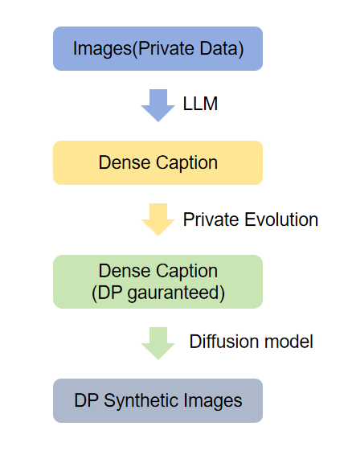

## Image2Text2Image DP: Differential Privacy Data Synthesis Cross Modality
We believe that the text modality can introduce greater variation in image generation under DP constraints while not significantly compromising the quality of the generated data. I personally name our proposed method as **Image2Text2Image DP**, or **DPITI** for short.

### 💡 Proposed Methodology
Following the work [Lin et al.(2024)](https://openreview.net/forum?id=YEhQs8POIo),[Xie et al.(2024)](https://arxiv.org/abs/2403.01749), we aim to exploit more potential from LLM and diffusion models, thus we proposed the following method to enhance the variety of synthesized data while preserving accuracy.



### Environment
```bash
# Please prepare torch, transformers and diffusers yourself

# installing PE...
conda install -y -c pytorch -c nvidia faiss-gpu=1.8.0
pip install "private-evolution @ git+https://github.com/microsoft/DPSDA.git"
pip install "private-evolution[image,text] @ git+https://github.com/microsoft/DPSDA.git"

# Others...
```

### Experiment Setup
* **Dataset** : We use **LSUN dataset, bedroom class, train split** as our dataset.
* **Caption** : We're currently using `Salesforce/blip-image-captioning-large` as our caption llm
* **PE** : We use code from [DPSDA](https://github.com/microsoft/DPSDA) and follow its [example](https://github.com/microsoft/DPSDA/blob/main/example/text/pubmed_huggingface/main.py) to run Private Evolution
* **Diffusion** : We're currently using `stabilityai/stable-diffusion-xl-base-1.0`
* **Metrics & Benchmarks** : We're currently using FID and IS to evaluate the quality of synthetic data, and will use synthetic data for down-stream tasks.

### Experiment Results
We post some of our experiment results in the following tables, while example results can be seen in `docs/examples` directory.

<!DOCTYPE html>
<html lang="en">
<body>
<table>
    <tr>
        <td rowspan="2" colspan="3" align="center">PE</td>    
        <td colspan="1" align="center">OpenAI</td> 
        <td colspan="1" align="center">Ali</td> 
        <td colspan="1" align="center">Salesforce</td> 
    </tr>
    <tr>
        <td align="center">gpt-4o-mini</td> 
        <td align="center">qwen-vl-max</td> 
        <td align="center">blip-image-captioning-large</td>    
    </tr>
    <tr>
        <td colspan="3" align="center">Original Caption</td>
        <td align="center">13.5</td>
        <td align="center">12.3</td>
        <td align="center"></td>
    </tr>
    <tr>
        <td rowspan="2" align="center">Huggingface</td>
        <td rowspan="2" align="center">meta-llama/Meta-Llama-3-8B-Instruct</td>
        <td align="center">noise_multiplier=0.0</td>
        <td align="center">29.9</td>
        <td align="center">28.2</td>
        <td align="center"></td>
    </tr>
    <tr>
        <td align="center">epsilon=1.0</td>
        <td align="center">40.27</td>
        <td align="center">40.3</td>
        <td align="center"></td>
    </tr>
    <tr>
        <td rowspan="2" align="center">Ali</td>
        <td rowspan="2" align="center">qwen-max</td>
        <td align="center">noise_multiplier=0.0</td>
        <td align="center">34.6</td>
        <td align="center"></td>
        <td align="center"></td>
    </tr>
    <tr>
        <td align="center">epsilon=1.0</td>
        <td align="center"></td>
        <td align="center"></td>
        <td align="center"></td>
    <caption>Table 1: SOTA Experiment results using different captioners and PE LLMs. Evaluation is conducted using <b>10,000+ 1024x1024images</b> generated by <b>stabilityai/stable-diffusion-xl-base-1.0</b> and the original <b>LSUN bedroom dataset</b>. Metric is <b>FID</b>
    </caption> 
</table>
</body>
</html>

---

<!DOCTYPE html>
<html lang="en">
<body>
<table>
    <tr>
        <td colspan="2" align="center">Captioner</td>    
        <td colspan="2" align="center">PE LLM</td>    
        <td colspan="1" align="center">0</td> 
        <td colspan="1" align="center">1</td> 
        <td colspan="1" align="center">2</td> 
        <td colspan="1" align="center">3</td> 
        <td colspan="1" align="center">4</td> 
        <td colspan="1" align="center">5</td> 
        <td colspan="1" align="center">6</td> 
        <td colspan="1" align="center">7</td> 
        <td colspan="1" align="center">8</td> 
        <td colspan="1" align="center">9</td> 
        <td colspan="1" align="center">10</td> 
    </tr>
    <tr>
        <td rowspan="2" align="center">OpenAI</td>
        <td rowspan="2" align="center">gpt-4o-mini</td>
        <td align="center">Huggingface</td>
        <td align="center">meta-llama/Meta-Llama-3-8B-Instruct</td>
        <td align="center">32.05</td>
        <td align="center">32.28</td>
        <td align="center"></td>
        <td align="center"></td>
        <td align="center"></td>
        <td align="center"></td>
        <td align="center">31.4</td>
        <td align="center">31.2</td>
        <td align="center">30.5</td>
        <td align="center">30.5</td>
        <td align="center">29.9</td>
    </tr>
    <tr>
        <td align="center">Ali</td>
        <td align="center">qwen-max</td>
        <td align="center"></td>
        <td align="center"></td>
        <td align="center"></td>
        <td align="center"></td>
        <td align="center"></td>
        <td align="center"></td>
        <td align="center"></td>
        <td align="center"></td>
        <td align="center"></td>
        <td align="center"></td>
    </tr>
    <caption>Table 2: Experiment results on different checkpoints of the same settings.
    </caption> 
</table>
</body>
</html>


### To-Do
* ✅ Add a logger.
* ✅ Currently we caption images with normal length.
   * ✅ Enable Dense Caption in `caption/script.py`. 
   * ✅ use OpenAI API key (gpt-4o) or 千问 API keys to generate dense caption.
* (Temporally solved) We find running PE decline text quality heavily.
   * ✅ Examined the `textpe/run_pe.py` script to identify the factors contributing to the decline in PE data quality.
   * ✅ Using API from OpenAI.
   * Try using fill-in-the-blanks for the model
   * change prompt for models
    * ✅ prompt with word "short" in the model
    * prompt model to remove header
    * prompt model to give a fine tail
    * prompt that the model is going to generate prompt for stable diffusion model
    * few-shot demonstration
* Currently we do sampling using a `diffusers` pipeline.
   * find a way to increase `max_token_num` for diffusion models.`
   * Use more agents to do image sampling. Read more papers to see if this strategy greatly improves the quality.
   * DALL-E / Stable-Diffusion
* We need to find a standard evaluation method
    * we should resize to 256 first to call fid code
    * use LSUN preprocess repo
* Compute fid on different checkpoints.
* Use caption to generate image samples directly -> serve as upper bound.
   * ✅ use OpenAI API caption